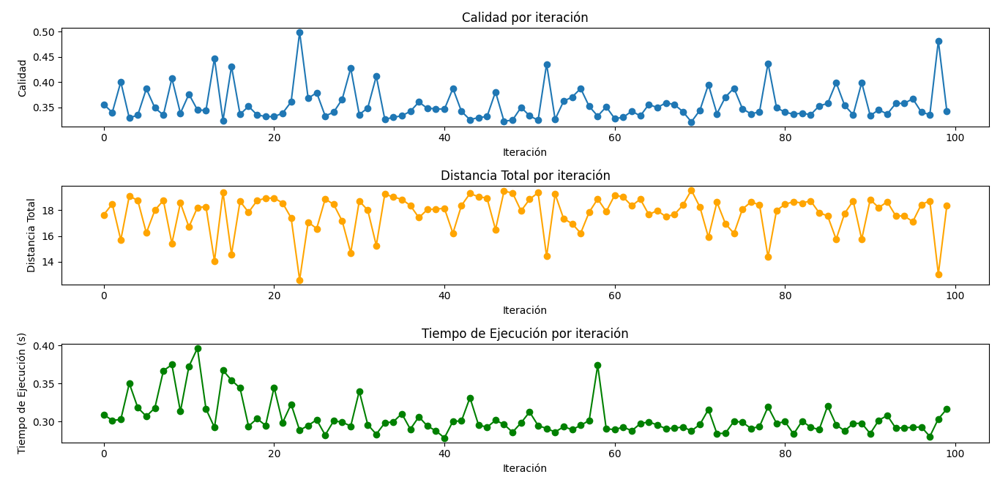
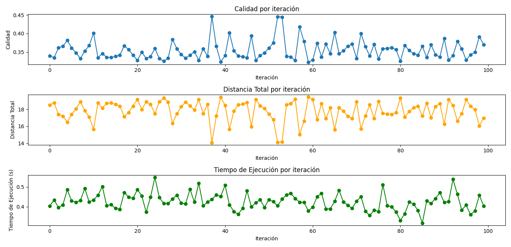
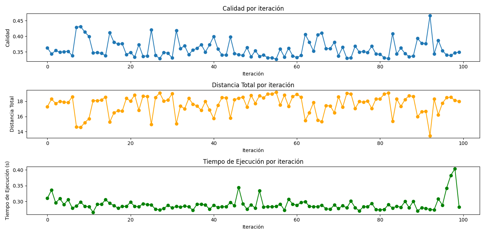

# Reporte sobre el uso de Simulated Annealing en el problema del agente viajero (TSP)

> Hecho por: Fabián Neftaly Guía Cruz, Daniela Gutierrez Pérez

El algoritmo de recocido simulado toma el concepto de Hill Climbing para encontrar las soluciones, excepto que
este algoritmo no es tan estricto como otros algoritmos que solo aceptan soluciones de mejor calidad. Este algoritmo
tiene la funcion que en base a una probabilidad puede aceptar soluciones peores con el fin de poder encontrar una solucion
aun mejor en el futuro. Durante el progreso del algoritmo esta probabilidad de aceptacion disminuye para que asi el
algoritmo pueda terminar encontrando la solucion mas factible.

## Definición de la funcionalidad del algoritmo

Para este algorimo se requieren 3 aspectos mas: La temperatura, Una funcion G(T,t) que disminuya la temperatura de forma gradual mientras avanza el algoritmo y una manera de calcular la probabilidad de aceptación que se define como

<p>
    P = e<sup>-(Quality(R) - Quality(S)) / T</sup>
</p>

Siendo R la nueva solucion y S la solucion anterior, T es la temperatura en ese momento.

La temperatura inicial del algoritmo se establecion en 1000

La funcion G se establecio como:

<p >
    G(T<sub>0</sub>, t) = T<sub>0</sub> &times; (1 / log(1 + t))
</p>

y el numero de iteraciones que debe hacer el algoritmo antes de el cambio de temperatura se establecio en 1500 iteraciones.

## Uso de las funciones Tweek

Las graficas muestran el comportamiento de 100 pruebas en diferentes mapeos de ciudades donde se encontro la mejor solución. Comparando calidad, distancia maxima y tiempo de ejecución

### Funcion Tweek 1: Inversion entre dos nodos



1. Calidad por Iteración:

   - La dispersión en la calidad se debe en parte a la aleatoriedad intrínseca de las inversiones y a la probabilidad de aceptar peores soluciones al inicio (por la alta temperatura).

   - La tendencia global muestra que el algoritmo puede encontrar soluciones de calidad aceptable en diferentes escenarios, pero hay margen para mejorar la consistencia (e.g., afinando el número de iteraciones o ajustando la función de enfriamiento).

2. Distancia Total por Iteración:

   - Las oscilaciones en las distancias reflejan la exploración activa del espacio de soluciones, lo cual es esperado con el operador de inversión. Esto es positivo porque indica que el algoritmo no queda atrapado fácilmente en mínimos locales en las primeras etapas.

   - La estabilización en el rango de distancias finales sugiere que el método de inversión logra encontrar recorridos razonablemente buenos para distintos mapeos de ciudades.

3. Tiempo de Ejecución por Iteración:

   - La inversión entre nodos es computacionalmente eficiente (ya que afecta solo una pequeña parte de la solución), lo que explica por qué los tiempos por iteración son consistentes.

   - Los picos ocasionales podrían estar relacionados con el cálculo de la calidad de las soluciones vecinas en problemas más complejos (e.g., un mapeo con muchas intersecciones cercanas).

Ejemplo de una ejecución:
Mejor ruta: [8, 1, 4, 9, 3, 7, 10, 5, 6, 2]

Calidad: 0.4819511418269046

Distancia total: 13.036975663886333

Tiempo de ejecucion: 0.30328893661499023

Cambios realizados durante el tiempo de ejecucion y cambio de temperatura para aceptar soluciones peores

```JSON
    "Cambios": {
        'iteracion_1': 822, 'iteracion_2': 831,
        'iteracion_3': 827, 'iteracion_4': 832,
        'iteracion_5': 812, 'iteracion_6': 817,
        'iteracion_7': 807, 'iteracion_8': 831,
        'iteracion_9': 841, 'iteracion_10': 806,
        'iteracion_11': 824, 'iteracion_12': 837,
        'iteracion_13': 812, 'iteracion_14': 822,
        'iteracion_15': 822, 'iteracion_16': 757,
        'iteracion_17': 701, 'iteracion_18': 642,
        'iteracion_19': 488, 'iteracion_20': 362,
        'iteracion_21': 263, 'iteracion_22': 244,
        'iteracion_23': 217, 'iteracion_24': 198,
        'iteracion_25': 174, 'iteracion_26': 226,
        'iteracion_27': 175, 'iteracion_28': 165,
        'iteracion_29': 209, 'iteracion_30': 189,
        'iteracion_31': 172, 'iteracion_32': 181,
        'iteracion_33': 210, 'iteracion_34': 210,
        'iteracion_35': 182, 'iteracion_36': 199
    }
```

Podemos ver que aun despues de muchos enfriamientos se siguen aceptando muchos intercambios, pero se vuelve mas selectivo pero algunas fluctuaciones son debido a la utilizacion de la funcion exponencial que para cuando la diferencia de calidades es muy pequeña la probabilidad de ser aceptada una solucion nueva se dispara haciendo que se acepten esas soluciones.

### Funcion Tweek 2: Intercambio entre dos nodos



1. Calidad por Iteración:
   - Se encuentra un comportamiento medio parecido en la calidad de las soluciones encontradas, sin embargo existen muy pocos picos de calidad
2. Distancia por iteración:
   - Al estar relacionado con el punto anterior se muestran las mismas oscilaciones, con algunos picos en las distancias mas bajas y en promedio las distancias estan entre 15 y 19

Ejemplo de ejcución
Mejor ruta: [9, 7, 10, 4, 5, 6, 3, 1, 2, 8]

Calidad: 0.35395587723427413

Distancia total: 17.751323572516668

Tiempo de ejecucion: 0.373729944229126

```JSON
    "Cambios":  {
        'iteracion_1': 754, 'iteracion_2': 738,
        'iteracion_3': 729, 'iteracion_4': 753,
        'iteracion_5': 758, 'iteracion_6': 756,
        'iteracion_7': 761, 'iteracion_8': 758,
        'iteracion_9': 747, 'iteracion_10': 752,
        'iteracion_11': 756, 'iteracion_12': 737,
        'iteracion_13': 756, 'iteracion_14': 744,
        'iteracion_15': 719, 'iteracion_16': 702,
        'iteracion_17': 640, 'iteracion_18': 478,
        'iteracion_19': 254, 'iteracion_20': 74,
        'iteracion_21': 38, 'iteracion_22': 18,
        'iteracion_23': 7, 'iteracion_24': 4,
        'iteracion_25': 0, 'iteracion_26': 0,
        'iteracion_27': 0, 'iteracion_28': 0,
        'iteracion_29': 0, 'iteracion_30': 0,
        'iteracion_31': 0, 'iteracion_32': 0,
        'iteracion_33': 0, 'iteracion_34': 0,
        'iteracion_35': 0, 'iteracion_36': 0}
```

Con esta funcion tweek se logra ver como si se logra que se dejen de hacer intercambios con soluciones peores a diferencia con el metodo anterior.

### Funcion Tweek 3: Insercion de un nodo



1. Calidad por Iteración:
   - La calidad sigue oscilando entre los valores de 0 y 0.5 sin llegar a acercarse a los valores de 1 en calidad que seria lo mas deseado. No se logra persibir un promedio de calidad superior respecto a otras funciones
2. Distancia por iteración:
   - La calidad de las soluciones que encuentra el algoritmo con esta funcion tweek no se desvia tanto de las anteriores, sigue teniendo un promedio entre 15 y 18 de distancia.

Mejor ruta: [5, 4, 3, 6, 8, 7, 10, 2, 9, 1]

Calidad: 0.4191526678905457

Distancia total: 14.99020712143082

Tiempo de ejecucion: 0.28527331352233887

```JSON
    "Cambios":  {
        'iteracion_1': 770, 'iteracion_2': 805,
        'iteracion_3': 803, 'iteracion_4': 800,
        'iteracion_5': 784, 'iteracion_6': 804,
        'iteracion_7': 797, 'iteracion_8': 819,
        'iteracion_9': 806, 'iteracion_10': 820,
        'iteracion_11': 794, 'iteracion_12': 820,
        'iteracion_13': 841, 'iteracion_14': 823,
        'iteracion_15': 796, 'iteracion_16': 766,
        'iteracion_17': 677, 'iteracion_18': 581,
        'iteracion_19': 363, 'iteracion_20': 208,
        'iteracion_21': 140, 'iteracion_22': 154,
        'iteracion_23': 147, 'iteracion_24': 133,
        'iteracion_25': 126, 'iteracion_26': 125,
        'iteracion_27': 136, 'iteracion_28': 122,
        'iteracion_29': 131, 'iteracion_30': 120,
        'iteracion_31': 132, 'iteracion_32': 126,
        'iteracion_33': 114, 'iteracion_34': 142,
        'iteracion_35': 133, 'iteracion_36': 129}
```

Se puede notar que la exigencia del algoritmo aumenta tambien con esta funcion sin embargo nunca llega a ser tan estricto con las temperaturas mas bajas como el metodo anterior.

## Conclusiones

La variacion y poca exactitud en las pruebas logra mostrar que aunque la temperatura inical puede ser suficiente al estar establecida en 1000 y la funcion G parece ser adecuada. No se logran ver grandes soluciones al problema y esto parece estar causado debido a que las funciones tweek generan soluciones vecinas demasiado parecidas en calidad aunque diferentes en recorrido, por lo que la solucion salta por el espacio de busqueda demasiadas veces al tener diferencias tan bajas en calidad.

En general la implementación del algoritmo es buena pero las funciones tweek no parecen ser las indicadas para esta implementación, se necesitaria volver a plantear nuevas funciones tweek o buscar una forma de que la seleccion de alternativas peores sea mas estricta.

## Codigo fuente

El codigo fuente para generar esta información se encuentra en github en el siguiente link [https://github.com/NeftaliGC/busquedas_exhaustiva_aleatoria_y_Hill_Climbing_para_TSP]
