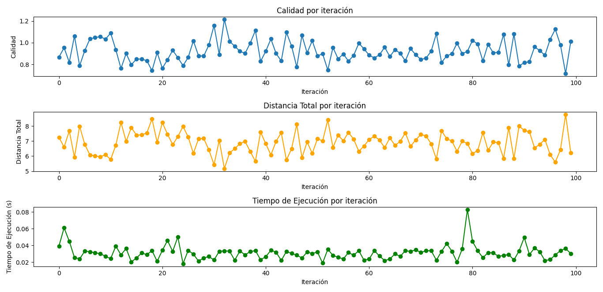
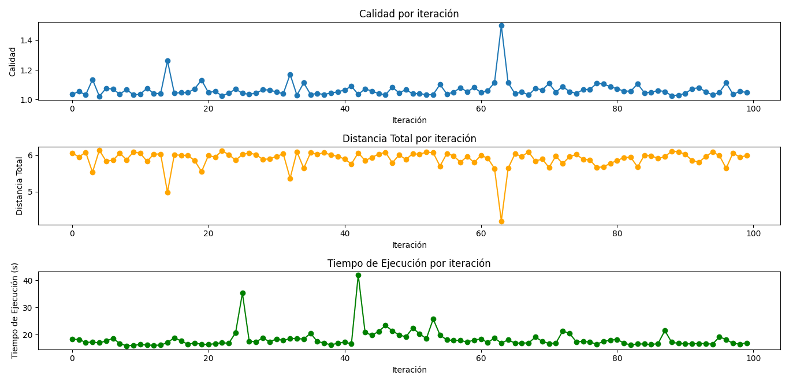
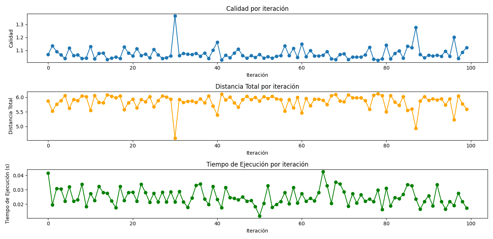
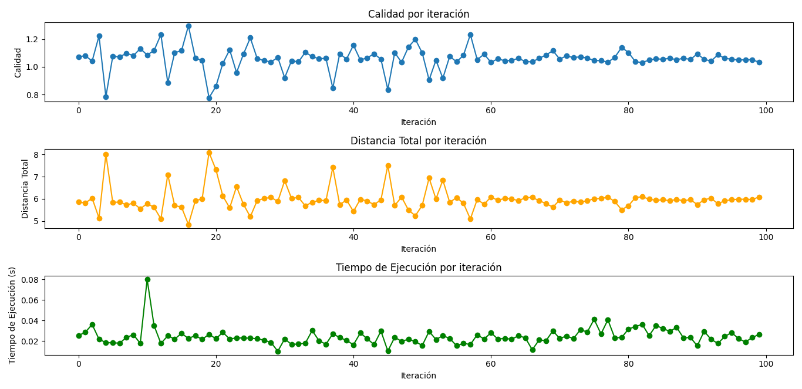
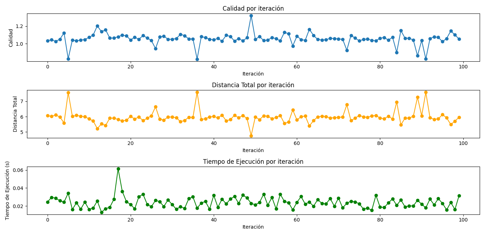

# Reporte sobre el uso de Búsqueda Exhaustiva, Búsqueda Aleatoria y Hill Climbing en el problema del agente viajero (TSP)

> Hecho por: Fabián Neftaly Guía Cruz, Daniela Gutierrez Pérez

El Problema del Agente Viajero (TSP) es un problema de optimización combinatoria en el que se busca encontrar la ruta más corta para un agente (o viajero) que debe visitar un conjunto de nodos (ciudades) exactamente una vez y retornar al nodo de inicio, completando así un ciclo. La dificultad del TSP radica en que, a medida que aumenta el número de nodos, el número de rutas posibles crece factorialmente, haciendo que la solución óptima sea computacionalmente costosa de encontrar.

Para abordar este problema, existen varios algoritmos de búsqueda, cada uno con sus propias características y ventajas. A continuación, se detallan los métodos de Búsqueda Exhaustiva, Búsqueda Aleatoria y Hill Climbing, junto con una descripción de cómo se aplican al TSP.

## 1. Búsqueda Exhaustiva

La Búsqueda Exhaustiva consiste en evaluar todas las posibles rutas que el agente puede tomar. En el caso del TSP, esto significa generar todas las permutaciones posibles de las ciudades y calcular la distancia total para cada una de ellas. La ruta con la menor distancia total es la solución óptima.

## 2. Búsqueda Aleatoria

La Búsqueda Aleatoria genera rutas de manera aleatoria y evalúa su longitud. Este método no intenta explorar sistemáticamente todas las rutas posibles; en su lugar, genera diferentes rutas de manera aleatoria y se queda con la mejor encontrada durante las iteraciones.

## 3. Hill Climbing

Hill Climbing es un método de búsqueda heurística en el que se empieza con una ruta inicial y, en cada iteración, se realizan pequeñas modificaciones (movimientos) para obtener rutas vecinas. La ruta se actualiza solo si la modificación genera una ruta más corta. El proceso se repite hasta que no haya más mejoras posibles, es decir, hasta alcanzar un "pico" o una solución local óptima.

## Solución del TSP con cada algoritmo

### 1. Configuración del Problema

Para asegurar una evaluación coherente entre los algoritmos, se ha optado por una configuración común:

- **Distribución de Ciudades**: Las ciudades (nodos) se han distribuido aleatoriamente en un círculo de radio 1. Esto permite calcular las distancias basándonos en una distancia euclidiana normalizada.
- **Calidad de la Ruta**: En esta disposición, la mejor ruta posible tendría una longitud cercana a 2π, que es el perímetro del círculo. Esto proporciona un criterio objetivo de calidad que se puede utilizar para comparar la eficiencia de cada algoritmo.
- **Número de Ciudades**: Se han utilizado 10 ciudades, lo cual permite que la Búsqueda Exhaustiva sea computacionalmente factible y otorga un contexto comparable para los otros métodos.

### 2. Parámetros de Ejecución

Para poder observar y analizar la convergencia y la calidad de las soluciones, se han establecido los siguientes parámetros:

- **Iteraciones**: Todos los algoritmos han sido configurados con 100 iteraciones como parámetro estándar para medir su evolución en distintas situaciones con soluciones diferentes.
- **Límite de Evaluaciones**: En el caso de Búsqueda Aleatoria y Hill Climbing, se ha establecido un límite de 3000 evaluaciones. Esto proporciona suficiente margen para que ambos algoritmos puedan intentar mejorar sus soluciones.

## Resultados

### 1. Búsqueda Aleatoria

  
Como podemos observar, la calidad de las soluciones es bastante variable en las 100 iteraciones y no se logra percibir un patrón de convergencia. Además, la distancia se aleja en muchas ocasiones del objetivo de 2π. Sin embargo, el tiempo de ejecución es excelente, ya que nunca supera un segundo.

---

### 2. Búsqueda Exhaustiva

  
La calidad de las rutas obtenidas se suele mantener consistente entre un rango de 1.0 y 1.1. La distancia de las soluciones se encuentra entre 5.75 y 6.25, lo cual nos muestra que en promedio se acerca a la distancia óptima. Sin embargo, el tiempo de ejecución es considerable, con un promedio de 20 segundos por iteración, lo que entorpece la búsqueda de soluciones.

---

### 3. Hill Climbing

#### Tweak 1 (inversión entre dos nodos)

  
La calidad se dispersa entre 1.4 y 1.15, con algunas excepciones. La distancia de las soluciones está un poco más dispersa que con fuerza bruta, aunque cercana a los valores esperados de 2π. El tiempo de ejecución es rápido, manteniéndose debajo de medio segundo.

#### Tweak 2 (intercambio entre dos nodos)

  
Aquí se observa una calidad dispersa entre 1.0 y 1.1, lo que indica que se consiguen buenas soluciones. La distancia de las soluciones parece estar algo dispersa al principio, pero después se estabiliza y converge cerca del valor de 2π. El tiempo de ejecución es menor a medio segundo, por lo que el método es bastante rápido.

#### Tweak 3 (inserción de un nodo)

  
Al igual que con los métodos anteriores, la calidad de las soluciones se mantiene entre 1.0 y 1.1, lo que significa que las soluciones son buenas. Las distancias oscilan, pero la mayoría de las veces están cerca de 2π. El tiempo también es bastante bueno.

## Conclusiones

Se concluye que la opción con resultados más estables para cualquier iteración es Hill Climbing con el intercambio entre dos nodos, ya que sus gráficas son las más estables y menos oscilantes de todos los métodos. Sin embargo, cualquiera de las funciones tweak de Hill Climbing es adecuada, ya que en promedio presentan soluciones factibles.

Hill Climbing para cualquier caso dado de n ciudades también se comporta de manera adecuada, lo que lo convierte en una buena opción para resolver el TSP. No obstante, si buscamos extrema precisión, la Búsqueda Exhaustiva es la mejor opción, aunque puede tardar mucho tiempo si el conjunto de ciudades es grande. En este caso, se estaría sacrificando precisión por exactitud.

## Codigo fuente

El codigo fuente para generar esta información se encuentra en github en el siguiente link [https://github.com/NeftaliGC/busquedas_exhaustiva_aleatoria_y_Hill_Climbing_para_TSP]
